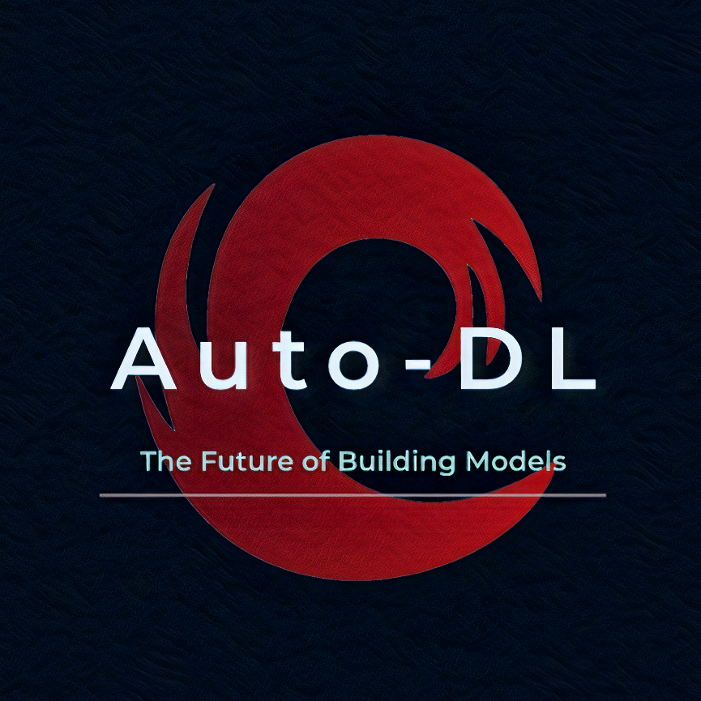

  

# Auto-DL 

### Introduction
Auto-DL helps you make Deep Learning models without writing a single line of code and giving as little input as possible.

- Using the GUI, you can specify the model components and [DLMML](https://github.com/Auto-DL/DLMML) will convert it to code, in the language and framework of your choice.

- You can input the task and other abstract inputs like “data directory”, and the model architecture will also be generated by Auto-DL. It will truly be a one-click DL model development.

## Info regrding the website code:
- `baseScripts()` in base.js: appends the head tags and the body tags (description, seo, favicon, css, other cdn links) into each html page thereby making it easier to load cdn links in every page without mentioning them in every page

- `$('header').load('header.html #reuse-head')`: load the header content which is in the `header.html` file into every html page 

- `$(window).on('load', ()=>{ $.get(...)})`: this will load the content from the yaml files into every page

- `jsyaml`: this package is used for converting the yaml content to json

- `stringToHTML()`: used for parsing html tags which are in simple text format for the DOM to recognize the html content
