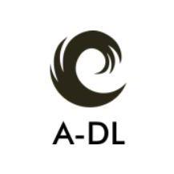

<p align="center">
  
</p>

[](https://www.python.org/)

[](https://join.slack.com/t/autodl/shared_invite/zt-m6dxvsow-~dW4FTy3QDLAK~WYeg_3Ig)

# Auto-DL 

### Introduction
Auto-DL helps you make Deep Learning models without writing a single line of code and giving as little input as possible.

- Using the GUI, you can specify the model components and [DLMML](https://github.com/Auto-DL/DLMML) will convert it to code, in the language and framework of your choice.

- You can input the task and other abstract inputs like “data directory”, and the model architecture will also be generated by Auto-DL. It will truly be a one-click DL model development.

### To run Auto DL

1. Clone the repo

```
git clone https://github.com/Auto-DL/Generator.git
git submodule init
git submodule update
```

2. Install the requirements

```bash
pip install requirements.txt
cd FrontEndApp
npm install
```

3. Run the application

```
python BackEndApp/manage.py runserver
cd FrontEndApp
npm start
```
