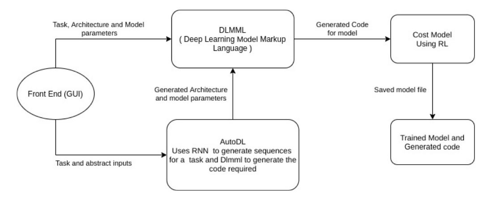

# Auto-DL
### Develop Deep Learning  models without a single line of code.

#### The Problem

Building Deep Learning models takes a lot of time and needs expertise of the Deep Learning Engineer 
or Data Scientists in multiple domains including and not limited to mathematics, computer science, usage of libraries.

The process of using Deep Learning involves various steps:
 * Data Acquisition
 * Feature Engineering
 * Model Architecture Design
 * Selection of Hyper parameters
 * Metrics of evaluation, Loss/Reward function
 * Solving Problems that occur during training

There is a need of a platform that provides an easy interface to ease the iterations 
one has to take before getting a deployment ready solution is needed. 

### Our Solution

- The user can make a customized DL model without writing its code, using the GUI interface
- It will contain the different components or layers of the DL model
- The DLMML or “Deep Learning Model Markup Language” part will convert it to an intermediate representation (IR)
- This will be then passed to a parser which will convert the IR to code.

[*CODE FOR DLMML*](https://github.com/Auto-DL/DLMML)

If the user wants to use Auto-DL, similar to the first step, 
he can input the task and other abstract inputs like “ data directory ” 
and the model architecture will also be generated by Auto-DL, 
it will truly be a one-click DL model development.

[*CODE FOR APPLICATION*](https://github.com/Auto-DL/Generator)

 

Complete System Dataflow:

### Why US

* Scalability: 
    Highly scalable as it can be deployed on a single compute system or a cluster of systems

* Data Security: 
    Data is stored and process on premises ensuring its security, i.e. Data never leaves your machine

* Explainability:
    Visualize and understand what the AI model is learning 

* Flexibility:
    Giving users choice to develop models in any framework and any programming language, thus allowing people from all backgrounds to collaborate and build solutions.

### About US

We are a team of 4 computer engineering students.

We saw, even though our friends and acquaintances know the theory and mathematics behind machine and deep learning, they were reluctant to write or modify code.

We believe that If people from non-coding background also get engaged with application of Deep learning, acceptance and use of AI / DL in day to day life will increase.

This will eliminate the fear of AI and create a general awareness and understanding of Artificial Intelligence.

This will also ease the process of Teaching AI and DL to beginners.

### Support or Contact

See anything wrong? 

Have questions or want to contribute? Raise an issue [here](https://github.com/Auto-DL/auto-dl.github.io/issues)

A team member will reach out to you shortly! 
